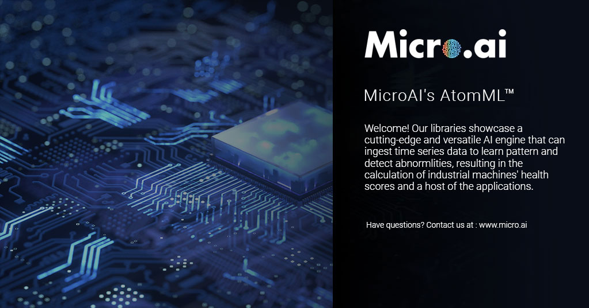

<!-- PROJECT SHIELDS -->
<!--
-->
[![LinkedIn][linkedin-shield]](https://www.linkedin.com/company/27247876)

<!-- PROJECT LOGO -->
 

  

  <h3 align="center">MicroAI's AtomML™</h3>

  

    Access the Table of Contents below to browse through instructions, information about our MicroAI libraries, and more. We hope you enjoy our product launch and are excited to see what you and your teams can create!
     
    

<!-- TABLE OF CONTENTS -->
## Table of Contents

* [About the Libraries](#about-the-libraries)
* [Usage](#usage)
* [Roadmap](#roadmap)
* [License](#license)
* [Contact](#contact)

<!-- ABOUT THE LIBRARIES -->
## About The Libraries

This repository contains libraries for the following MicroAI's AtomML platforms:

* ESP32

* Raspberry Pi3

<!-- USAGE EXAMPLES -->
## Usage

For sample use case applications, refer to the following SDK's (see the select repository for details):

* ESP32 APM SDK

* ESP32 Security SDK

* Raspberry Pi3 APM SDK

* Raspberry Pi3 Security SDK

<!-- ROADMAP -->
## Roadmap

See the [open issues](https://github.com/MicroAIInc/MicroAI-Atom-Libraries/issues) for a list of proposed features (and known issues).

<!-- LICENSE -->
## License

See  [Software Evaluation Licensing Agreement](https://github.com/MicroAIInc/MicroAI-Atom-Libraries/blob/master/MicroAI%20Atom%20Evaluation%20License%20Agreement.pdf)  for more information.

<!-- CONTACT -->
## Contact

Company: MicroAI™

Website: www.micro.ai

Email: support@micro.ai

<!-- MARKDOWN LINKS & IMAGES -->
<!-- https://www.markdownguide.org/basic-syntax/#reference-style-links -->
[contributors-shield]: https://img.shields.io/github/contributors/github_username/repo.svg?style=flat-square
[contributors-url]: https://github.com/github_username/repo/graphs/contributors
[forks-shield]: https://img.shields.io/github/forks/github_username/repo.svg?style=flat-square
[forks-url]: https://github.com/github_username/repo/network/members
[stars-shield]: https://img.shields.io/github/stars/github_username/repo.svg?style=flat-square
[stars-url]: https://github.com/github_username/repo/stargazers
[issues-shield]: https://img.shields.io/github/issues/github_username/repo.svg?style=flat-square
[issues-url]: https://github.com/github_username/repo/issues
[license-shield]: https://img.shields.io/github/license/github_username/repo.svg?style=flat-square
[license-url]: https://github.com/github_username/repo/blob/master/LICENSE.txt
[linkedin-shield]: https://img.shields.io/badge/-LinkedIn-black.svg?style=flat-square&logo=linkedin&colorB=555
[linkedin-url]: https://linkedin.com/in/github_username
[product-screenshot]: images/screenshot.png
